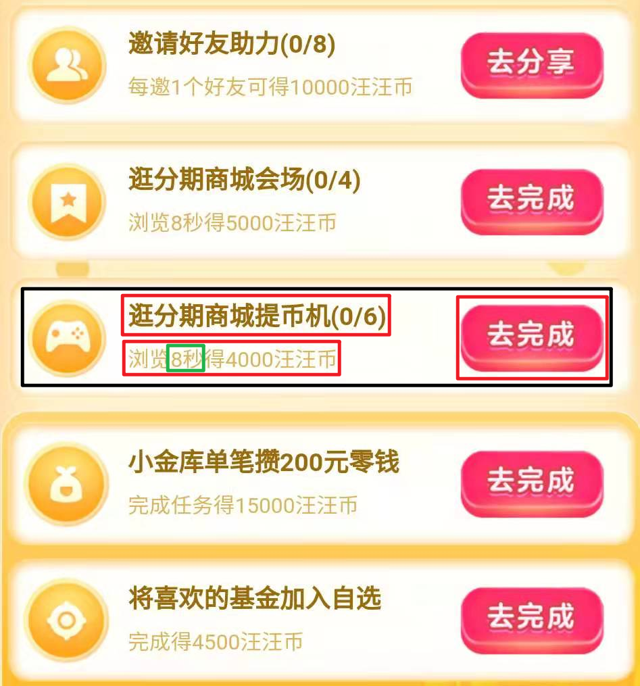

# 2021京东双十一

**其他优秀的项目：**

https://github.com/MonsterNone/tmall-miao（淘宝建议）

https://github.com/czj2369/jd_tb_auto

## 本项目使用方法

1. 在https://github.com/kkevsekk1/AutoX/releases中的下载地址下载[autox.js](https://github.com/kkevsekk1/AutoX)。

2. 将[jd20211111.js](jd20211111.js)和[jd20211111微信小程序.js](jd20211111微信小程序.js)添加到autox.js软件中。

3. 在**京东APP**和**京东金融APP**（京东金融不能完成所有任务）中运行[jd20211111.js](jd20211111.js)脚本，在**京东微信小程序**中运行[jd20211111微信小程序.js](jd20211111微信小程序.js)。

​		**务必手动打开任务页面（如下图所示），再运行脚本！！！**

## 本项目的特点

​		本项目仅完成**浏览**任务（其他项目会完成加购任务），但是支持京东金融和微信小程序的自动浏览。

## 本项目实现细节

​		找到含有“8秒”的文本框，通过其parent（黑框）找到child“去完成”，解决“去完成”是一张图像无法通过查找text定位的问题。

